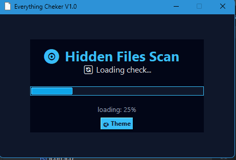
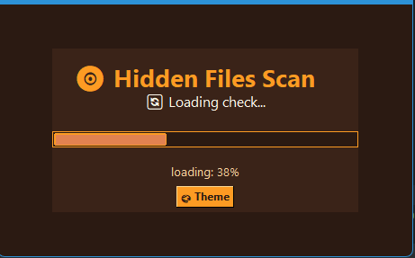
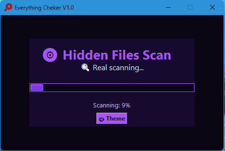

# Everything Checker V1.0

🛡 **Everything Checker** — это программа для поиска скрытых, подозрительных и потенциально опасных файлов на компьютере, с упором на обнаружение читов и модификаций для Minecraft.

Приложение использует несколько уровней анализа и современный интерфейс с поддержкой тем.

---

## 🚀 Возможности

✅ Поиск файлов по базе названий  
✅ Интеллектуальный AI-анализ `.exe` и `.dll` файлов  
✅ Анализ расположения файлов (Minecraft-папки и лаунчеры)  
✅ Подсчет прогресса сканирования в реальном времени  
✅ Удобное окно с результатами  
✅ Быстрый переход к найденным файлам  
✅ Поддержка цветовых тем  
✅ Современный дизайн

---

## 🧠 Как работает проверка

Программа выполняет несколько этапов:

### 1️⃣ Сканирование по базе
Проверка файлов по заранее заданному списку подозрительных названий.

### 2️⃣ AI-анализ
Интеллектуальная проверка `.exe` и `.dll` файлов:

- анализ имени файла
- проверка путей (Minecraft, лаунчеры, моды)
- поиск ключевых слов внутри файла
- анализ размера
- хэш-проверка
- оценка уровня риска

Каждому файлу присваивается **Risk Score**.

### 3️⃣ Отображение результатов
Все найденные файлы выводятся в отдельном окне с возможностью открыть их расположение.

---

## 🎨 Темы оформления

Everything Checker поддерживает несколько цветовых тем для удобной работы.

## Основные темы:

### - 🔵 Blue

### - 🟠 Orange

### - 🟣 Purple


Переключение тем происходит прямо в программе с помощью кнопки **Theme**.

---

## 📂 Структура проекта

#### Everything_checker/
#### │
#### ├── main.py # Основной файл программы
#### ├── theme.txt # Сохранение выбранной темы
#### ├── scanlist.txt # База имен файлов
#### ├── images/ # Скриншоты тем
#### └── README.md


---

## ⚙️ Требования

Для работы проекта необходимы:

- Python 3.9+
- Библиотеки:
  - tkinter
  - requests
  - psutil
  - hashlib

Установка зависимостей:

```bash
pip install requests psutil
## 🖥 Интерфейс

Программа состоит из:

✔️ Главного окна со статусом  
✔️ Прогресс-бара  
✔️ Кнопки смены темы  
✔️ Окна с результатами сканирования  

Все элементы автоматически подстраиваются под выбранную тему.

---

## 📌 Назначение проекта

Everything Checker предназначен для:

- проверки системы на наличие читов  
- анализа сторонних программ  
- контроля целостности Minecraft-клиента  
- повышения безопасности пользователя  

Проект подходит для личного использования и обучения.

---

## 📜 Лицензия

Проект распространяется для образовательных целей.

Автор не несет ответственности за неправильное использование программы.

---

## 🤝 Автор

Проект разработан: **SSDDAA-AFK**

GitHub: https://github.com/SSDDAA-AFK

---

## ⭐ Поддержка проекта

Если вам понравился проект — поставьте ⭐ на GitHub!
